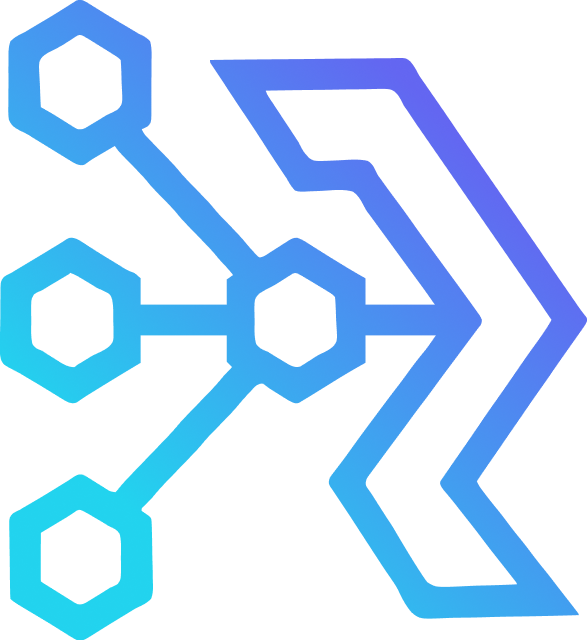
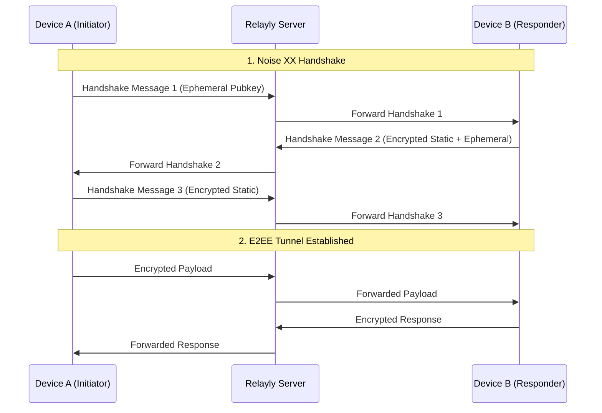

# Relayly



**Lightweight, self-hosted WebSocket relay for local-first, end-to-end encrypted device communication.**

[](https://github.com/NIKX-Tech/relayly/actions/workflows/ci.yml)
[](https://goreportcard.com/report/github.com/NIKX-Tech/relayly)
[](https://securityscorecards.dev/projects/github.com/NIKX-Tech/relayly)
[](https://github.com/NIKX-Tech/relayly/actions/workflows/codeql.yml)
[](https://opensource.org/licenses/MIT)
<br>
[](https://github.com/NIKX-Tech/relayly)
[](https://github.com/NIKX-Tech/relayly/releases)
[](https://github.com/NIKX-Tech/relayly)
[](https://github.com/NIKX-Tech/relayly/stargazers)
[](https://github.com/NIKX-Tech/relayly/blob/main/.github/dependabot.yml)
<br>
[](https://github.com/sponsors/NIKX-Tech)
[](https://opencollective.com/nikx-technologies/projects/relayly)
[](https://pkg.go.dev/github.com/NIKX-Tech/relayly)
[](https://github.com/NIKX-Tech/relayly/tree/main/sdk/go)
[](https://github.com/NIKX-Tech/relayly/tree/main/sdk/ts)

Relayly enables trustless message routing between your own devices (phone, laptop, desktop, etc.) through a server you control. All communication is encrypted using the [Noise Protocol](https://noiseprotocol.org/), ensuring the relay server only ever handles opaque cryptographic blobs.

---

## 📖 Table of Contents

- [Features](#-features)
- [How it Works](#-how-it-works)
- [Quick Start](#-quick-start)
- [Official Client SDKs](#-official-client-sdks)
- [CLI Reference](#-cli-reference)
- [Configuration](#-configuration)
- [Admin UI](#-admin-ui)
- [WebSocket Connection Protocol](#-websocket-connection-protocol)
- [Production Deployment](#-production-deployment)
- [Security & Privacy](#-security--privacy)
- [Contributing](#-contributing)

---

## ✨ Features

| Feature | Detail |
|---|---|
| 🔐 **End-to-End Encryption** | Noise Protocol XX (X25519, ChaChaPoly) — server never sees plaintext |
| 📱 **Device Pairing** | 6-digit short code or QR code — no accounts required |
| ⚡ **Real-time Forwarding** | Low-latency WebSocket relaying with minimal server overhead |
| ♻️ **Auto-reconnect** | Exponential-backoff reconnection built into SDKs |
| 🗄️ **Zero-Config Storage** | Embedded SQLite storage — no external database required |
| 🐳 **Infrastructure Ready** | Pre-built Docker images and single portable binary |
| 🖥️ **Interactive Admin** | HTMX-powered dashboard for device and pairing management |
| 🔑 **Trustless Architecture** | Public Key Locking prevents server-side impersonation |

---

## ⚙️ How it Works

Relayly acts as a "dumb" router that facilitates secure handshakes and message forwarding.



### Encryption Details

Relayly uses **Noise Protocol XX** for the initial handshake and subsequent message transport. This provides:

- **Mutual Authentication**: Both devices verify each other's static public keys.
- **Forward Secrecy**: Session keys are ephemeral and discarded after use.
- **Zero-Knowledge Relay**: The server handles zero plaintext data.

---

## 🚀 Quick Start

### 1. Server Setup (Docker)

The fastest way to get a relay running is via Docker:

```bash
git clone https://github.com/NIKX-Tech/relayly.git
cd relayly
docker compose up --build -d

# Register your first device
docker exec relayly /relayly pair "My Device"
```

### 2. Server Setup (Local)

```bash
# Build the binary (Requires Go 1.22+)
go build -o relayly ./cmd/relayly

# Start the server
./relayly start

# In another terminal, generate a pairing code
./relayly pair "My Phone"
```

---

## 📦 Official Client SDKs

We provide official, highly-optimized SDKs for Go and TypeScript in the `sdk/` directory.

### Go SDK (`sdk/go`)

```go
import relayly "github.com/NIKX-Tech/relayly/sdk/go"

// Load or generate a persistent key
key, _ := relayly.LoadOrGenerateKey("~/.relayly/device.key")

// Connect to the relay server
client, _ := relayly.Connect(ctx, "ws://your-server:8080/ws", relayly.Options{
    DeviceID:   "your-device-id",
    PrivateKey: key,
})
defer client.Close()

// Get a pairing code to share
code, _ := client.RequestPairCode(ctx)
fmt.Println("Code:", code.Short)

// Or accept a code from another device
peer, _ := client.AcceptPair(ctx, "483921")

// Send/Receive
client.Send(ctx, peer.ID, []byte("Hello!"))
msg := <-client.Messages()
```

### TypeScript SDK (`sdk/ts`)

```typescript
import { RelaylyClient } from 'relayly-client';

const client = new RelaylyClient({
  url: 'ws://your-server:8080/ws',
  deviceId: 'your-device-id',
  privateKey: yourNoisePrivateKey,
});

await client.connect();

// Events
client.on('message', (msg) => console.log(msg.payload));
client.on('paired', (peer) => console.log('New peer:', peer.id));
```

---

## 💻 CLI Reference

| Command | Description |
|---|---|
| `relayly start` | Start relay + admin servers |
| `relayly start --config path/to/relayly.yaml` | Use custom config |
| `relayly pair <name>` | Register device, print QR code |
| `relayly pair <name> --no-qr` | Print token only |
| `relayly link <id1> <id2>` | Pair two devices for relaying |
| `relayly status` | Show connected devices + uptime |
| `relayly status --format=json` | Machine-readable output |

---

## 🔧 Configuration

All options can be set in `config/relayly.yaml` or via environment variables (`RELAYLY_<KEY>`, e.g. `RELAYLY_PORT=9090`):

| Key | Default | Description |
|---|---|---|
| `host` | `0.0.0.0` | Listen address |
| `port` | `8080` | Relay WebSocket port |
| `db.path` | `./data/relayly.db` | SQLite file |
| `noise.key_path` | `./data/server.noise.key` | Server Noise keypair |
| `admin.enabled` | `true` | Enable admin UI |
| `admin.host` | `127.0.0.1` | Admin bind address |
| `admin.port` | `8081` | Admin port |
| `log.level` | `info` | `debug|info|warn|error` |
| `log.format` | `json` | `json|console` |
| `tls.enabled` | `false` | Enable TLS (or use reverse proxy) |

---

## 🖥️ Admin UI

Visit `http://localhost:8081` after starting the server.

- **Dashboard**: Live connection count, uptime, device list.
- **Devices**: Full device management with one-click revoke.
- Auto-refreshes every 5 seconds via HTMX.

> ⚠️ The admin UI binds to `127.0.0.1` by default. Do not expose it publicly without authentication.

---

## 🔌 WebSocket Connection Protocol

Clients connect to:
`ws://<host>:<port>/ws?device_id=<uuid>&token=<pair-token>`

### Noise XX Handshake (3 messages)

1. **Client → Server**: [msg1: ephemeral pubkey]
2. **Server → Client**: [msg2: encrypted server static + ephemeral]
3. **Client → Server**: [msg3: encrypted client static]

After handshake, all subsequent frames are **opaque encrypted binary** — the relay never inspects them.

---

## 🚢 Production Deployment

### Recommended: Caddy as reverse proxy

```caddy
relay.yourdomain.com {
    reverse_proxy localhost:8080
}
```

### Security checklist

- [ ] Run behind TLS (Caddy / nginx)
- [ ] Bind admin UI to `127.0.0.1` (default)
- [ ] Mount `/data` as a persistent volume (contains DB + keypair)
- [ ] Back up `/data/relayly.db` and `/data/server.noise.key`

---

## 🛡️ Security & Privacy

Relayly is built on the principle of **Privacy by Design**:

- **Zero Data Harvesting**: No accounts, emails, or tracking.
- **Public Key Locking**: Once a device connects, the server "locks" it to that public key. Even a compromised server cannot swap keys without manual admin intervention.
- **Auditability**: Small, dependency-light codebase written in memory-safe Go.

---

## 🏗 Project Architecture

```text
relayly/
├── cmd/relayly/      # Main server entry point
├── internal/         # Private server logic (Relay, Database, Admin)
├── sdk/              # Official Client SDKs (Go, TS)
├── examples/         # Reference implementations
├── docs/             # Protocol specs & architecture deep-dives
├── .github/          # Unified CI/CD workflows
└── Dockerfile        # Optimized production image
```

---

## 🤝 Contributing

Contributions are welcome! Please read our [Contributing Guide](CONTRIBUTING.md) for details on our code of conduct, and the process for submitting pull requests to us.

---

## 📄 License

Distributed under the MIT License. See `LICENSE` for more information.

© [NIKX Technologies B.V.](https://github.com/NIKX-Tech)
