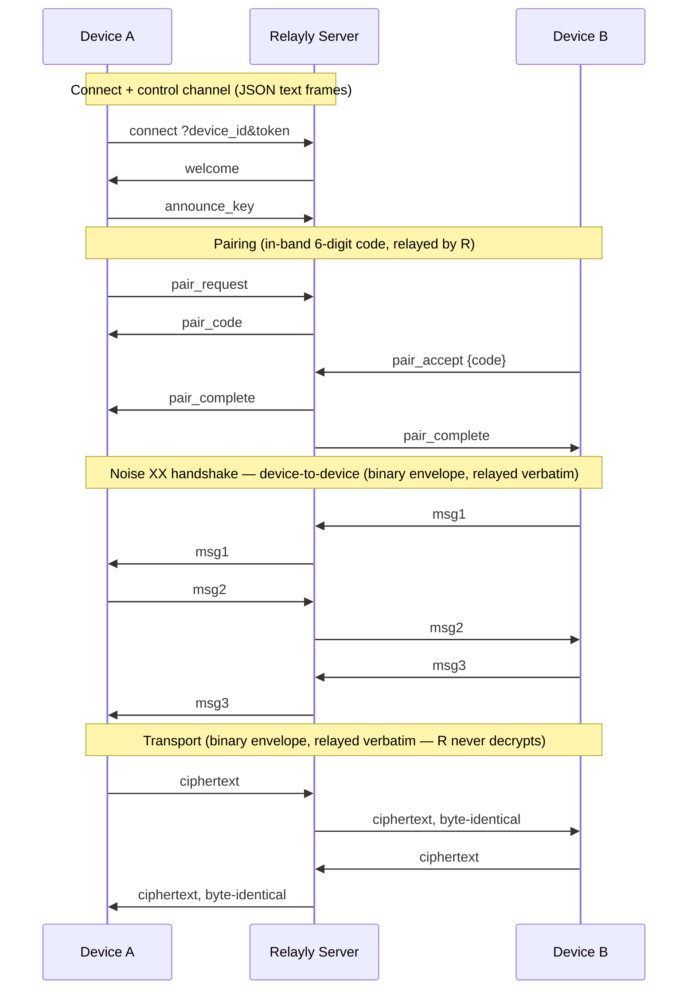

<!-- markdownlint-disable MD033 -->
# Relayly


**Lightweight, self-hosted WebSocket relay for local-first, end-to-end encrypted device communication.**

[](https://github.com/NIKX-Tech/relayly/actions/workflows/ci.yml)
[](https://securityscorecards.dev/projects/github.com/NIKX-Tech/relayly)
[](https://github.com/NIKX-Tech/relayly/actions/workflows/codeql.yml)
[](https://opensource.org/licenses/MIT)
<br>
[](https://github.com/NIKX-Tech/relayly)
[](https://github.com/NIKX-Tech/relayly/releases)
[](https://github.com/NIKX-Tech/relayly)
[](https://github.com/NIKX-Tech/relayly/stargazers)
[](https://github.com/NIKX-Tech/relayly/blob/main/.github/dependabot.yml)
<br>
[](https://github.com/sponsors/NIKX-Tech)
[](https://opencollective.com/nikx-technologies/projects/relayly)
[](https://pkg.go.dev/github.com/NIKX-Tech/relayly/sdk/go)
[](https://www.npmjs.com/package/relayly)
[](https://pypi.org/project/relayly/)
[](https://crates.io/crates/relayly)
<br>
[](https://relayly.app)
[](https://discord.gg/cTFMfk6V7)

Relayly enables trustless message routing between your own devices (phone, laptop,
desktop, etc.) through a server you control. Encryption runs device-to-device using the
[Noise Protocol](https://noiseprotocol.org/) (`Noise_XX_25519_ChaChaPoly_BLAKE2s`); the
relay authenticates devices and mediates pairing, but holds no key material capable of
reading message content, see [`docs/PROTOCOL.md`](docs/PROTOCOL.md) for the exact contract.

> **SDK status:** the server implements Protocol v1 as of `docs/tasks/01-server.md`.
> The official SDKs (`sdk/go`, `sdk/ts`, `sdk/py`, `sdk/rust`) do not yet, they still
> speak the pre-v1 wire format and cannot connect to this server until
> `docs/tasks/02-sdks-and-interop.md` lands. See
> [RFC-000](docs/rfc/000-protocol-reconciliation.md) for why, and
> [`docs/ROADMAP.md`](docs/ROADMAP.md) for where that work stands.

---

## 📖 Table of Contents

- [Features](#-features)
- [How it Works](#-how-it-works)
- [Quick Start](#-quick-start)
- [Official Client SDKs](#-official-client-sdks)
- [CLI Reference](#-cli-reference)
- [Configuration](#-configuration)
- [Admin UI](#-admin-ui)
- [WebSocket Connection Protocol](#-websocket-connection-protocol)
- [Production Deployment](#-production-deployment)
- [Security & Privacy](#-security--privacy)
- [Contributing](#-contributing)

---

## ✨ Features

| Feature | Detail |
|---|---|
| 🔐 **End-to-End Encryption** | Noise Protocol XX (X25519, ChaChaPoly) device-to-device; the relay holds no key material capable of reading messages |
| 📱 **Device Pairing** | 6-digit short code or QR code, no accounts required |
| ⚡ **Real-time Forwarding** | Low-latency WebSocket relaying with minimal server overhead |
| ♻️ **Auto-reconnect** | Exponential-backoff reconnection built into SDKs |
| 🗄️ **Zero-Config Storage** | Embedded SQLite storage, no external database required |
| 🐳 **Infrastructure Ready** | Pre-built Docker images and single portable binary |
| 🖥️ **Interactive Admin** | HTMX-powered dashboard for device and pairing management |
| 🔑 **Trustless Architecture** | Public Key Locking prevents server-side impersonation |

---

## ⚙️ How it Works

Relayly authenticates devices, mediates pairing, and relays two kinds of WebSocket
frames: JSON control messages (text) and an opaque E2E envelope (binary). The Noise XX
handshake and all message encryption happen **device-to-device**; the relay forwards the
binary envelope verbatim and holds no key material that could decrypt it.


```mermaid
sequenceDiagram
    participant A as Device A
    participant R as Relayly Server
    participant B as Device B

    Note over A,R: Connect + control channel (JSON text frames)
    A->>R: connect ?device_id&token
    R->>A: welcome
    A->>R: announce_key

    Note over A,B: Pairing (in-band 6-digit code, relayed by R)
    A->>R: pair_request
    R->>A: pair_code
    B->>R: pair_accept {code}
    R->>A: pair_complete
    R->>B: pair_complete

    Note over A,B: Noise XX handshake — device-to-device (binary envelope, relayed verbatim)
    B->>R: msg1
    R->>A: msg1
    A->>R: msg2
    R->>B: msg2
    B->>R: msg3
    R->>A: msg3

    Note over A,B: Transport (binary envelope, relayed verbatim — R never decrypts)
    A->>R: ciphertext
    R->>B: ciphertext, byte-identical
    B->>R: ciphertext
    R->>A: ciphertext, byte-identical
```

### Encryption Details

Relayly runs **Noise Protocol XX** (`Noise_XX_25519_ChaChaPoly_BLAKE2s`) between the two
paired devices. This provides:

- **Mutual Authentication**: the two devices verify each other's static public keys
  directly with each other, the relay is not a party to the handshake.
- **Forward Secrecy**: session keys are ephemeral; a fresh handshake runs on reconnect
  per the initiator rule in [`docs/PROTOCOL.md`](docs/PROTOCOL.md#6-e2e-channel-binary-frames).
- **Zero-Knowledge Relay**: the relay holds no cipher states and cannot decrypt the
  binary envelope; it only sees who is talking to whom and how much, not the content.
  Client-side key pinning (not just the relay's own announced-key check) is the real
  security boundary, see §7 of the spec.

Two layers of key locking guard against a compromised relay: devices pin the peer's
static key on first pairing (the actual boundary), and the relay separately locks each
device's *announced* key as defense in depth. See
[RFC-000](docs/rfc/000-protocol-reconciliation.md) for how this design was chosen.

---

## 🚀 Quick Start

### 1. Server Setup (Docker)

The fastest way to get a relay running is via Docker:

```bash
git clone https://github.com/NIKX-Tech/relayly.git
cd relayly
docker compose up --build -d

# Register your first device
docker exec relayly /relayly pair "My Device"

# Want to test it? Try the Chat Demo:
# cd examples/go/chat && ./setup.sh
```

---

## 🎮 Interactive Examples

Check out the `examples/` directory for ready-to-run implementations:

| Example | Language | Description |
|---|---|---|
| [**Chat Demo**](examples/go/chat) | Go | **(Recommended)** Live E2EE chat between two terminals |
| [Clipboard Sync](examples/go/clipboard-sync) | Go | Sync clipboard across devices automatically |
| [Basic Echo](examples/go/basic) | Go | Simplest possible connect and message loop |
| [Pair & Send](examples/go/pair-and-send) | Go | CLI pairing and one-shot message exchange |
| [Node.js Send](examples/ts/node) | TypeScript | Connect, pair, and send from Node.js |
| [Echo Server](examples/ts/echo) | TypeScript | Minimal echo client in TypeScript |

### 2. Server Setup (Local)

```bash
# Build the binary (Requires Go 1.22+)
go build -o relayly ./cmd/relayly

# Start the server
./relayly start

# In another terminal, generate a pairing code
./relayly pair "My Phone"
```

---

## 📦 Official Client SDKs

Official SDKs for Go, TypeScript, and Python are in the `sdk/` directory and published to their respective package registries.

### Go SDK

```bash
go get github.com/NIKX-Tech/relayly/sdk/go
```

```go
import relayly "github.com/NIKX-Tech/relayly/sdk/go"

key, _ := relayly.LoadOrGenerateKey("~/.relayly/device.key")

// deviceToken comes from POST /api/v1/devices (or `relayly pair`)
client, _ := relayly.Connect(ctx, "wss://your-server/ws", relayly.Options{
    DeviceID:    "my-laptop",
    DeviceToken: deviceToken,
    PrivateKey:  key,
})
defer client.Close()

code, _ := client.RequestPairCode(ctx)
fmt.Println("Code:", code.Short)

peer, _ := client.AcceptPair(ctx, "483921")
client.Send(ctx, peer.ID, []byte("hello!"))
msg := <-client.Messages()
```

[pkg.go.dev/github.com/NIKX-Tech/relayly/sdk/go](https://pkg.go.dev/github.com/NIKX-Tech/relayly/sdk/go)

### TypeScript / JavaScript SDK

```bash
npm install relayly
```

```typescript
import { RelaylyClient, generateKey } from 'relayly';

// deviceToken comes from POST /api/v1/devices
const client = new RelaylyClient('wss://your-server/ws', {
  deviceId: 'my-laptop',
  deviceToken,
  keyPair: generateKey(),
});

await client.connect();

const code = await client.requestPairCode();
console.log('Code:', code.shortCode);

const peer = await client.acceptPair('483921');
await client.send(peer.id, 'hello!');
client.on('message', (msg) => console.log(msg.payload));
```

[npmjs.com/package/relayly](https://www.npmjs.com/package/relayly) - works in Node.js, browsers, and React Native.

### Python SDK

```bash
pip install relayly
```

```python
import asyncio, relayly

async def main():
    key = relayly.load_or_generate_key("~/.relayly/device.key")
    client = await relayly.connect("wss://your-server", relayly.Options(
        device_id="my-laptop",
        private_key=key,
    ))
    async for msg in client.messages():
        print(msg.payload.decode())

asyncio.run(main())
```

[pypi.org/project/relayly](https://pypi.org/project/relayly/)

### Rust SDK

```toml
[dependencies]
relayly = "0.3"
tokio = { version = "1", features = ["full"] }
```

```rust
use relayly::{connect, load_or_generate_key, Options};
use std::path::Path;

#[tokio::main]
async fn main() -> Result<(), Box<dyn std::error::Error>> {
    let key = load_or_generate_key(Path::new("~/.relayly/device.key"))?;
    let (client, mut messages) = connect("wss://your-server", Options {
        device_id: "my-laptop".into(),
        private_key: key,
        ..Default::default()
    }).await?;

    tokio::spawn(async move {
        while let Some(msg) = messages.recv().await {
            println!("[{}] {}", msg.from, String::from_utf8_lossy(&msg.payload));
        }
    });

    let code = client.request_pair_code().await?;
    println!("Share this code: {}", code.short);
    let peer = code.wait().await?;
    client.send(&peer.id, b"hello!").await?;
    Ok(())
}
```

[crates.io/crates/relayly](https://crates.io/crates/relayly)

---

## 💻 CLI Reference

| Command | Description |
|---|---|
| `relayly start` | Start relay + admin servers |
| `relayly start --config path/to/relayly.yaml` | Use custom config |
| `relayly pair <name>` | Register device, print QR code |
| `relayly pair <name> --no-qr` | Print token only |
| `relayly link <id1> <id2>` | Pair two devices for relaying |
| `relayly status` | Show connected devices + uptime |
| `relayly status --format=json` | Machine-readable output |

---

## 🔧 Configuration

All options can be set in `config/relayly.yaml` or via environment variables (`RELAYLY_<KEY>`, e.g. `RELAYLY_PORT=9090`):

| Key | Default | Description |
|---|---|---|
| `host` | `0.0.0.0` | Listen address |
| `port` | `8080` | Relay WebSocket port |
| `db.path` | `./data/relayly.db` | SQLite file |
| `admin.enabled` | `true` | Enable admin UI |
| `admin.host` | `127.0.0.1` | Admin bind address |
| `admin.port` | `8081` | Admin port |
| `log.level` | `info` | `debug|info|warn|error` |
| `log.format` | `json` | `json|console` |
| `tls.enabled` | `false` | Enable TLS (or use reverse proxy) |

---

## 🖥️ Admin UI

Visit `http://localhost:8081` after starting the server.

- **Dashboard**: Live connection count, uptime, device list.
- **Devices**: Full device management with one-click revoke.
- Auto-refreshes every 5 seconds via HTMX.

> ⚠️ The admin UI binds to `127.0.0.1` by default. Do not expose it publicly without authentication.

---

## 🔌 WebSocket Connection Protocol

This is a summary; [`docs/PROTOCOL.md`](docs/PROTOCOL.md) is the normative spec.

Clients connect to:
`ws://<host>:<port>/ws?device_id=<uuid>&token=<device-token>`

Auth happens at the HTTP layer (query params, before the WebSocket upgrade). There is no
in-band auth frame and no client<->server cryptographic handshake.

### Frame discipline

- **Text frames** carry the JSON control channel: `welcome`, `announce_key`, pairing
  (`pair_request`/`pair_code`/`pair_accept`/`pair_complete`), `peer_status`,
  `ping`/`pong`, `error`.
- **Binary frames** carry a 1-byte-prefixed E2E envelope (`0x01` Noise handshake message,
  `0x02` Noise transport ciphertext) between the two paired devices. The relay forwards
  these **verbatim**, it does not parse, decrypt, or hold any key material for them.

### Key locking

Two layers, both described in full in `docs/PROTOCOL.md` §7: each device pins its peer's
static key on first pairing (the real security boundary), and the relay separately locks
each device's *announced* key as defense in depth against a third party impersonating a
device to the relay. Neither substitutes for the other.

---

## 🚢 Production Deployment

### Recommended: Caddy as reverse proxy

```caddy
relay.yourdomain.com {
    reverse_proxy localhost:8080
}
```

### Security checklist

- [ ] Run behind TLS (Caddy / nginx)
- [ ] Bind admin UI to `127.0.0.1` (default)
- [ ] Mount `/data` as a persistent volume (contains the database)
- [ ] Back up `/data/relayly.db`

---

## 🛡️ Security & Privacy

Relayly is built on the principle of **Privacy by Design**:

- **Zero Data Harvesting**: No accounts, emails, or tracking.
- **Public Key Locking**: Once a device connects, the server "locks" it to that public key. Even a compromised server cannot swap keys without manual admin intervention.
- **Auditability**: Small, dependency-light codebase written in memory-safe Go.

---

## 🏗 Project Architecture

```text
relayly/
├── cmd/relayly/      # Main server entry point
├── internal/         # Private server logic (Relay, Database, Admin)
├── sdk/              # Official Client SDKs (Go, TS)
├── examples/         # Reference implementations
├── docs/             # Protocol specs & architecture deep-dives
├── .github/          # Unified CI/CD workflows
└── Dockerfile        # Optimized production image
```

---

## 💬 Community

Have questions or want to show off what you're building? Join our [Discord Server](https://discord.gg/cTFMfk6V7) to connect with other developers and get real-time support.

---

## 🤝 Contributing

Contributions are welcome! Please read our [Contributing Guide](CONTRIBUTING.md) for details on our code of conduct, and the process for submitting pull requests to us.

---

## 📄 License

Distributed under the MIT License. See `LICENSE` for more information.

© [NIKX Technologies B.V.](https://github.com/NIKX-Tech)
